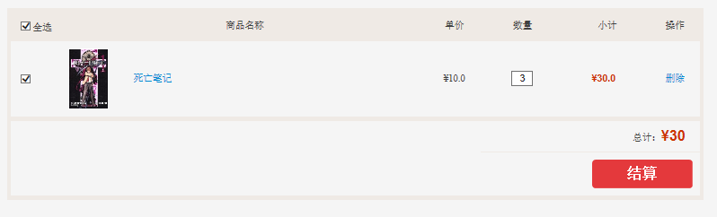
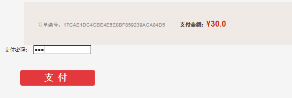
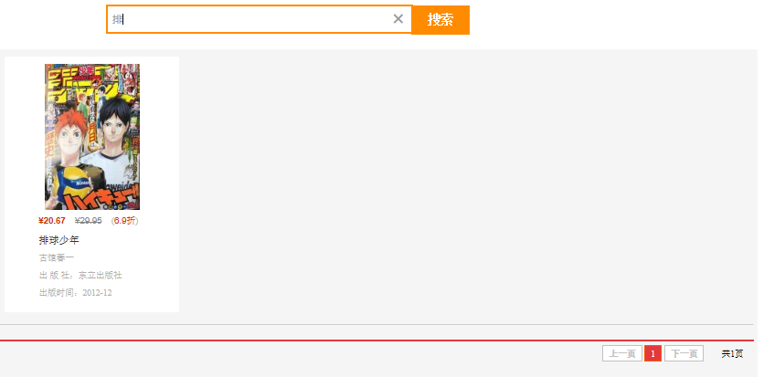
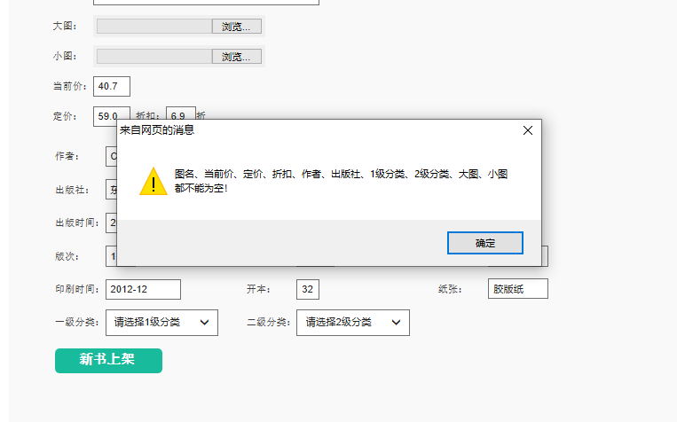

<h1 align="center">Online Comic Book Store</h1>

### :page_facing_up: Introduction
With the proliferation of the internet and technological advancements, online shopping has become a part of daily life for many people. While general shopping websites offer a wide range of products, including books, there are few dedicated comics online stores now. Therefore, I chose to develop an online comic bookstore using JSP + Servlet + JavaBean + JDBC technologies.

The main functional modules of this online bookstore are as follows:

### :fireworks: show results

#### Front-End Functions
Login page:

Front Page:

Registration Page:

Book Details Page:

Purchase:

Select:

#### Back-End Functions

Books Management:

